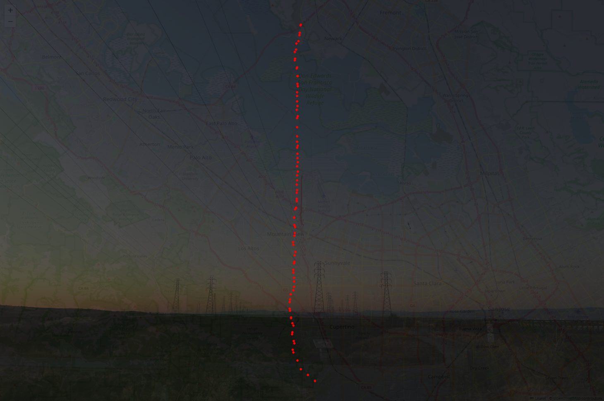

# Strava Art

Simple Streamlit App that takes a Strava activity's GPX file and an image and gives you some control over how
they are overlaid with a map to make some half-decent art.

## How to use
- Install [uv](https://github.com/astral-sh/uv?tab=readme-ov-file#installation)
- Install Python: `uv python install 3.9`
- Make a virtual environment: `uv venv --python 3.9`
- Activate your venv (uv will tell you how)
- `uv run -- streamlit run main.py`